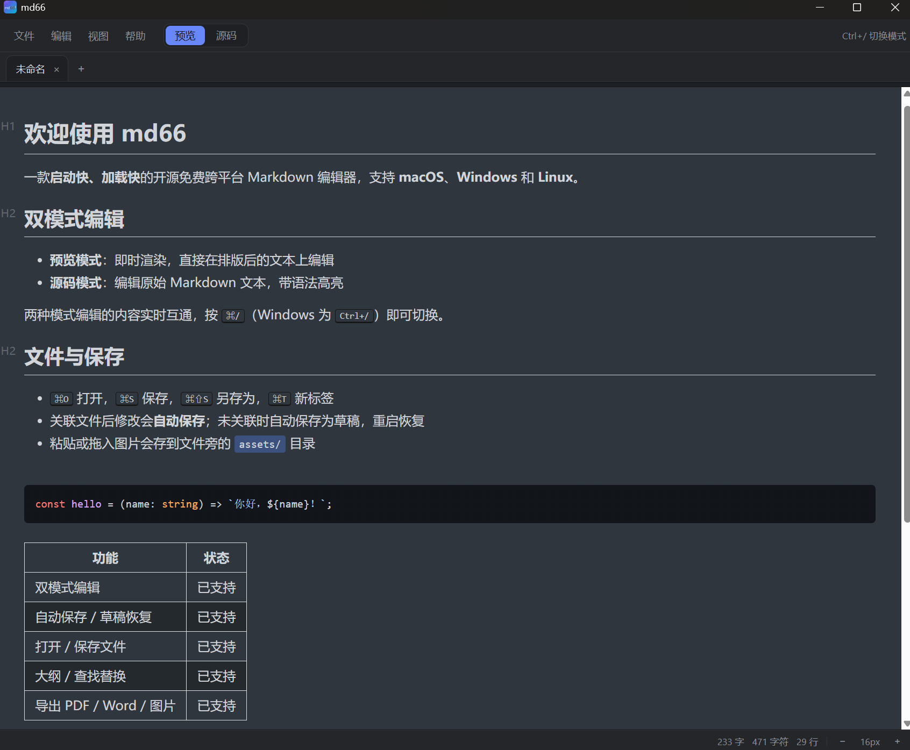

# md66

<div align="center">



</div>

[简体中文](./README.md) | [English](./README.en.md)

  


A free, open-source, cross-platform Markdown editor that **starts fast and loads fast** — for **macOS**, **Windows**, and **Linux**.

Built with Tauri 2 + Svelte 5: preview mode is powered by the [Vditor](https://github.com/Vanessa219/vditor) live-rendering engine, source mode by [CodeMirror 6](https://codemirror.net/).

> 🔒 **Privacy first**: no personal data collected — network access is only to GitHub Releases for downloading updates.

## Why it's fast

- ⚡ **~0.3s cold start** (measured) — native Tauri 2 (Rust) core, no bundled browser, none of Electron's bloat
- 📄 **Large files open instantly** — long documents open, scroll, and type smoothly
- 📦 **~11 MB installer** — all editor assets are bundled locally, zero network requests at startup, fully **offline-capable**

## Download

[GitHub Releases](https://github.com/shareven/md66/releases)

| Platform | Installer |
|---|---|
| macOS (universal ARM64 + x86_64) | `.dmg` |
| Windows | NSIS `.exe` installer |
| Linux | `.deb` / AppImage |

> Built-in update check: on launch the app compares its version against the latest GitHub Release; when a newer version exists, an update button appears at the top — one click downloads and installs it.

## Features

### Dual-mode editing

- **Preview mode**: live rendering — edit directly on the formatted rich text (Typora-style)

- **Source mode**: edit raw Markdown with syntax highlighting, line numbers, and code folding

- Both modes stay in sync; switch anytime (⌘/ / Ctrl+/)

### Files & saving

- Open / save / save as (`.md` / `.markdown` / `.txt`)

- **Auto-save**: changes to linked files are written to disk automatically; otherwise kept as a draft and restored on restart

- Multi-tab editing with unsaved-change markers (red dot), confirm-before-close

- Recently opened files list

- External-change detection (prompts to reload when a file is modified elsewhere)

- Drag a `.md` / `.txt` file onto the window to open it

### Export

- PDF (direct A4-paginated export, no print dialog needed)

- Word (.doc)

- Long PNG image

- Print

### Editing aids

- Find & replace (⌘F, replace-all and per-match stepping)

- Outline panel (⌘⇧O, click a heading to jump)

- Word count (words / chars / lines)

- Font size control (⌘+ / ⌘- / ⌘0, remembered)

- Pasted / dropped images are saved to an `assets/` folder next to the file and referenced automatically

- Table of contents (\[TOC])

- Command palette (⌘⇧P)

- Multiple windows (⌘N)

### Rendering support

- GFM tables, task lists, footnotes, strikethrough, highlight

- Code syntax highlighting (language auto-detection)

- Math (KaTeX), flowcharts / sequence diagrams (Mermaid)

- Local image display (asset protocol, works offline)

### More

- **Bilingual UI**: follows the system language automatically — Chinese or English

- **In-app update check** (GitHub Release, one-click download & install)

- Light / dark theme following the system

- Markdown syntax guide (Help menu)

- All editor assets bundled locally — **works fully offline**

## Keyboard shortcuts

| Shortcut (macOS / Windows) | Action |
| -------------------- | -------------- |
| ⌘/ / Ctrl+/          | Toggle preview / source mode |
| ⌘N / Ctrl+N          | New window |
| ⌘T / Ctrl+T          | New tab |
| ⌘W / Ctrl+W          | Close tab |
| ⌘O / Ctrl+O          | Open file |
| ⌘S / Ctrl+S          | Save |
| ⌘⇧S / Ctrl+Shift+S   | Save as |
| ⌘F / Ctrl+F          | Find & replace |
| ⌘⇧O / Ctrl+Shift+O   | Outline panel |
| ⌘⇧P / Ctrl+Shift+P   | Command palette |
| ⌘P / Ctrl+P          | Print |
| ⌘+ / ⌘- / ⌘0 (Ctrl+= / Ctrl+- / Ctrl+0) | Zoom in / out / reset font size |

## Prerequisites

- [Node.js](https://nodejs.org/) 18+ and [yarn](https://yarnpkg.com/) (or npm)

- [Rust](https://www.rust-lang.org/) 1.77.2+ (`rustup update stable`)

Linux additionally needs system packages (Ubuntu / Debian example):

```bash
sudo apt update
sudo apt install libwebkit2gtk-4.1-dev build-essential curl wget file \
  libxdo-dev libssl-dev libayatana-appindicator3-dev librsvg2-dev
```

For Fedora / Arch etc., see the [Tauri prerequisites](https://tauri.app/start/prerequisites/).

## Development & build

```bash
# 1. Install dependencies
yarn install

# 2. Run in dev mode (hot reload)
yarn tauri dev
```

### Packaging

Three build scripts, one per platform. Each checks that the platform matches and prerequisites are installed, and explains the correct usage on failure.

> ⚠️ **Tauri cannot cross-compile installers** — you can only build the package for the OS you're on. Windows `.exe` must be built on Windows, `.dmg` on macOS.

| Platform | Command | Output |
|---|---|---|
| **macOS** | `./scripts/build-macos.sh` | `.dmg` (universal, ARM64 + x86_64) |
| **Windows** | `scripts\build-windows.bat` (CMD / PowerShell) | NSIS `.exe` installer |
| **Linux** | `./scripts/build-linux.sh` | `.deb` + AppImage |

All artifacts land under `src-tauri/target/release/bundle/` in their subdirectories.

To run the raw commands manually (equivalent to what the scripts do):

```bash
# macOS (universal, ARM64 + x86_64)
yarn build && yarn tauri build --target universal-apple-darwin --bundles dmg

# Windows (NSIS installer)
yarn build && yarn tauri build --bundles nsis

# Linux (deb + AppImage)
yarn build && yarn tauri build --bundles deb,appimage
```

## Project structure

```
src/                      Frontend (SvelteKit)
  lib/
    components/           Editor, menu bar, tab bar, outline, find, etc.
    editorStore.svelte.ts Global editor state (tabs / modes / font size)
    i18n.svelte.ts        Bilingual dictionary (Chinese / English, follows system language)
    updater.svelte.ts     GitHub Release update check, download & install
    fileService.ts        File I/O, draft sessions, path utilities
    exporter.ts           Export Word / image / print
  routes/                 Pages: editor / syntax guide / about
src-tauri/                Desktop shell (Rust / Tauri 2)
scripts/
  sync-vditor-assets.mjs  Syncs vditor runtime assets into static/ (offline use)
  build-macos.sh          macOS build script (with platform check)
  build-windows.bat       Windows build script (with platform check)
  build-linux.sh          Linux build script (with platform check)
```

## License

[MIT](./LICENSE)
